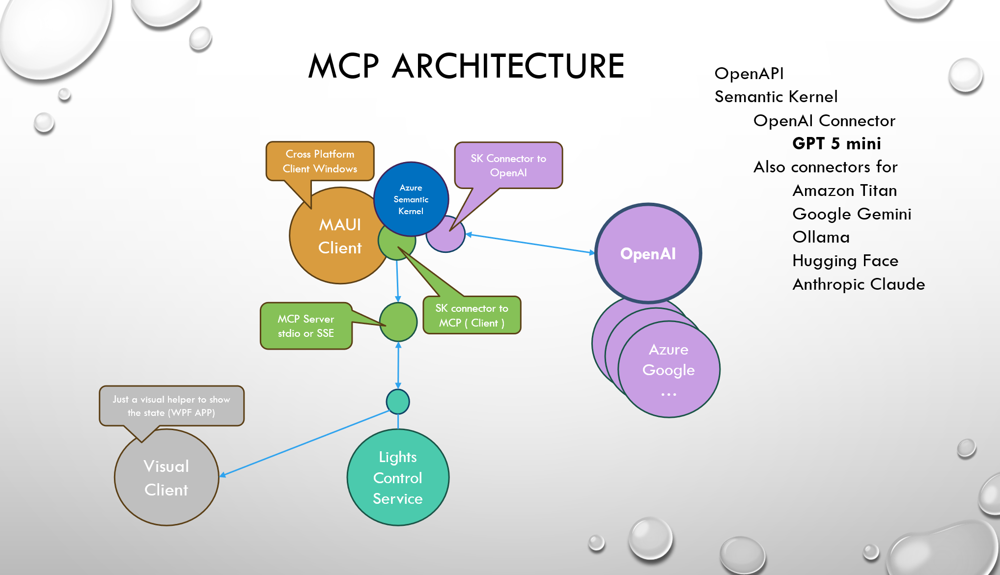
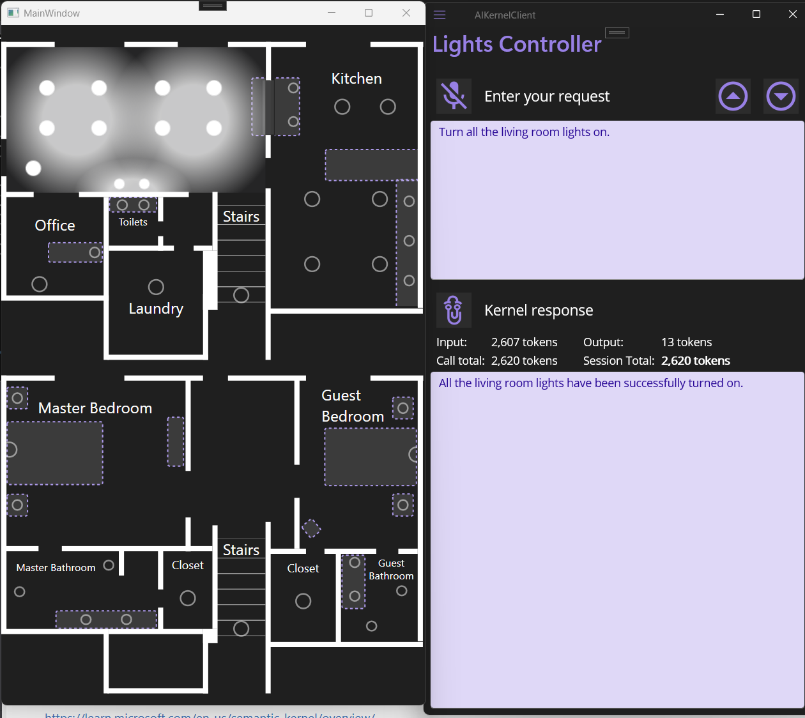
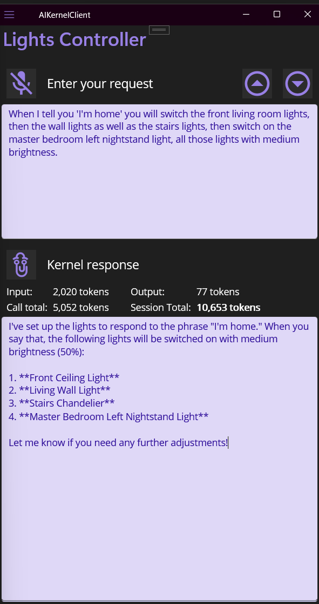
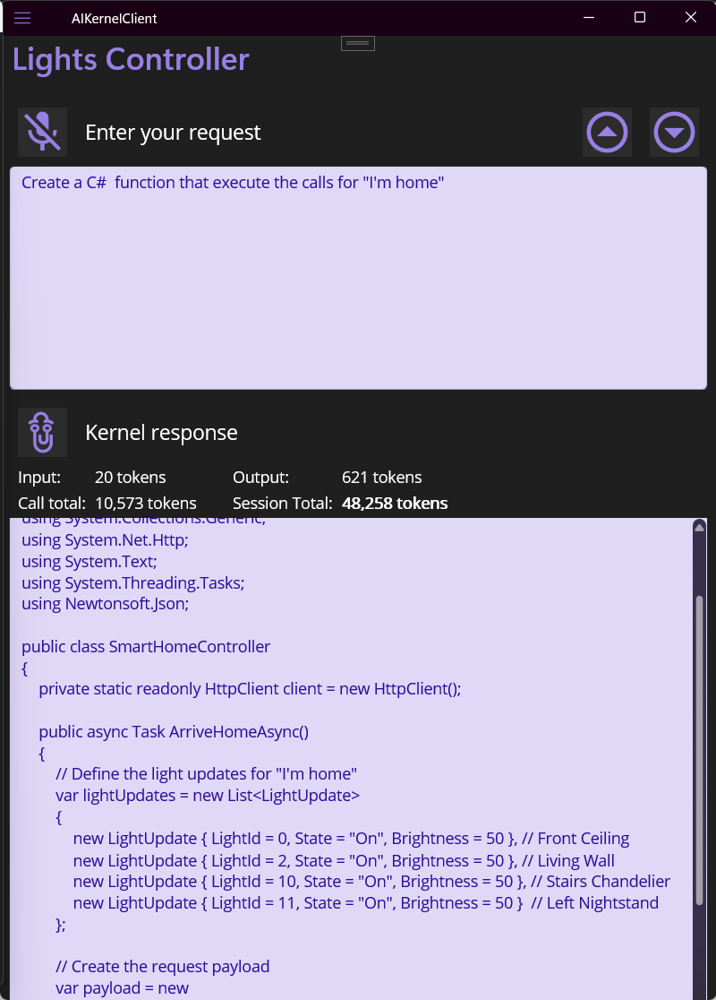

# AIKernelClient

## Overview
Ths project shows how to use Semantic Kernel inside a cross platform MAUI application to control a REST API service using OpenAI (ChatGPT) as the AI model.
Controllig the RestAPI through a MCP protocol enabled server. anf Semantic Kernel MCP plugin on the client side.

## Architecture


## Goals
- Create a MCP Server on top of an existing REST API service.
- Create a MAUI client application that uses Semantic Kernel to interact with an OpenAI model (ChatGPT 5 Mini or Nano) to control the service through prompts.
- Create A MCP client in the for of a Semantic Kernel plugin that connects to the MCP server.

We are implementing the Model Control Protocol (MCP) on both the server and client side.
As the architecture shows, the client application (AIKernelClient) is designed to interact with the AI model, allowing it to send intents and receive actions that can be executed on the service.
The Client now becomes an MCP Host, and the Server an MCP Server, acting as an intermediary between the client and the service.
The MCP protocol allows the AI to control the service directly by using intents, actions, and API calls.
The MCP protocol is enabled on both the server and client side, allowing the AI to control the service directly by using intents, actions, and API calls.


## Projects
The Solution is made of **5 C# .net 9.0 projects**
1. **Lights.RestApi:** The REST web service (Minimal API endpoints with OpenAPI generated definintion) **Is the service we want the AI to control** 

2. **Lights.MauiClient:** The controller application  **talking to the AI**: a cross platform **MAUI** (Multi platform) application that controls the service through prompts Using Semantic Kernel with a connector to OpenAI (Chat GPT 5 Mini or nano) it relays service calls from the AI.
- **ApiKeyProvider.cs** will provide the OpenAI API key from secure storage or environment variable
- **SemanticKernelService.cs** will create the kernel, load the plugin, and will call the AI model with the prompt

```csharp
var openAiApiKey = await ApiKeyProvider.GetApiKeyAsync();
var openApiOrgId = await ApiKeyProvider.GetAiOrgId();
// OpenAI chat connector
_builder.Services.AddOpenAIChatCompletion(
    modelId: chatModel,
    apiKey: openAiApiKey,
    orgId: openApiOrgId,
    serviceId: "lights"
);
``` 
- MCP Plugin creation and prompting occurs in the class Services/**SemanticKernelService.cs** injected to the MainPageViewModel.cs

```csharp
// Default: start the MCP server locally via SSE and bind its tools
// Connect to a running http  server 
await _kernel.Plugins.AddMcpFunctionsFromSseServerAsync(
       serverName: "Lights.McpServer",
       endpoint: McpWsUrl);
```

- **MainPageViewModel** will initialize the SemanticKernelService (**InitializeKernelAndPluginAsync**) and will call it to prompt the AI (**GetResponseAsync**)
- Speech to Text is also implemented in the **MainPageViewModel.cs** class, by dependency injection.

3. **Lights.WpfHouse:** A visualization application  that displays the changes done by the controller on the service by polling at regular intervals the changes made to the service resources (lights) (WPF application). 
4. **Lights.Common:** A shared Entities library  (with seeded data) is shared between Lights.RestApi, Lights.McpServer (for entities), and Lights.MauiClient (only for the pre created prompts)
5. **Lights.McpServer:** The MCP enabled server, a web application HTTP SSE service  that interacts with Lights.RestApi and enables the MCP protocol on it. It communicates with the MCP client (Lights.MauiClient) which relays the intents and actions from OpenAI chat LLM to The MCP Server.
```csharp
builder.Services.ConfigureHttpJsonOptions(options =>
{
    options.SerializerOptions.TypeInfoResolverChain.Insert(0, LightsJsonContext.Default);
});

// Combine resolvers so AOT metadata is available for *all* involved types
var toolSerializerOptions = new JsonSerializerOptions(JsonSerializerDefaults.Web)
{
    TypeInfoResolver = LightsJsonContext.Default   // Jso serialization from LightsAPICommon
};


builder.Services.AddMcpServer()
    .WithHttpTransport()
    .WithToolsFromAssembly(serializerOptions: toolSerializerOptions);

var app = builder.Build();

var mcpGroup = app.MapGroup("/mcp");
mcpGroup.MapMcp();   // <— call MapMcp on the group; all routes get the prefix + auth

app.Run();
```
## Detailed Architecture



## References

- Semantic Kernel

    https://learn.microsoft.com/en-us/semantic-kernel/overview/

 - Maui Speech to Text

    https://learn.microsoft.com/en-us/dotnet/communitytoolkit/maui/essentials/speech-to-text?tabs=windows

   
   
   
   
   
   
   
## Features at Work

1. Remove the logic from the client application, allowing the AI to control the service directly.
1. Create a smart service that can be controlled by a client with autorization.
1. Use Semantic Kernel to create a plugin that allows the AI to interact with the service.
1. Have the prompts sent to the smart service and redirect the intents to the service.
1. Use memory storage to cache states per room/floor/light if needed.
1. 1. Use the Model Control Protocol (MCP) to enable the AI to control the service by sending intents and receiving actions.
2. Remove the logic from the client application, allowing the AI to control the service directly.
1. Use the Model Control Protocol (MCP) to enable the AI to control the service by sending intents and receiving actions.
 

- **MCP**: Enable the Model Control Protocol On the Server.
- **MCP**: Enable the Model Control Protocol On the Client.
- The client application (AIKernelClient) is designed to interact with the AI model, allowing it to send intents and receive actions that can be executed on the service.
- Let SK “think” in terms of intents → actions → API calls.
Adding the Model Control Protocol (MCP) to the server allows the AI to control the service directly by using intents, actions, and API calls.
- **Use MemoryStore** or vector memory to cache states per room/floor/light if needed.
